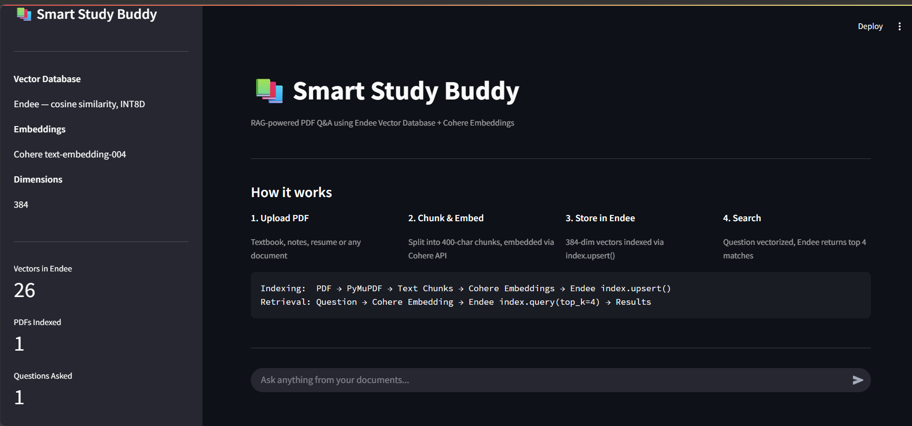
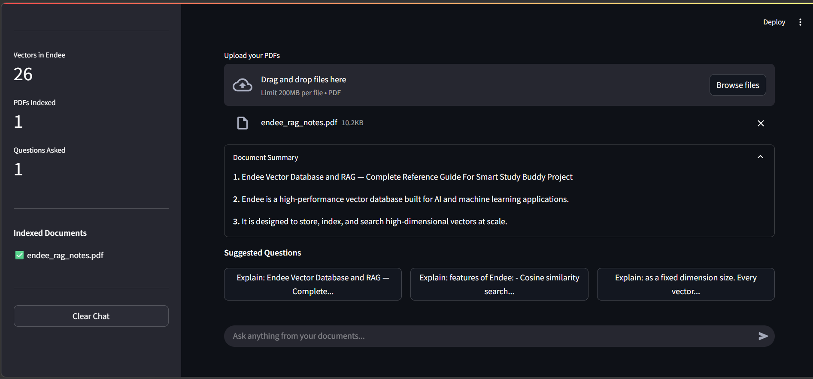
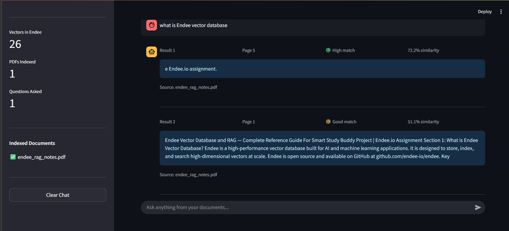
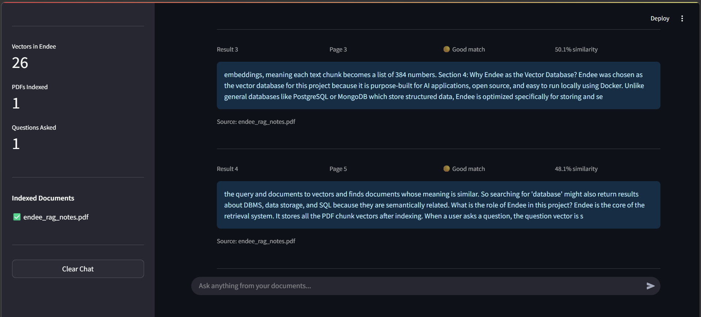

# 📚 Smart Study Buddy

> RAG-powered PDF Q&A application built using **Endee Vector Database** + **Cohere Embeddings**

[](https://github.com/endee-io/endee)
[](https://python.org)
[](https://streamlit.io)
[](https://docker.com)

---

## Screenshots

### Application Overview — How It Works


### PDF Uploaded and Indexed into Endee


### Semantic Search Results — High Match


### Multiple Results with Similarity Scores


---

## Project Overview

Smart Study Buddy is a RAG (Retrieval Augmented Generation) application that allows users to upload any PDF document and ask questions from it using semantic vector search. The application uses **Endee** as the core vector database to store and retrieve document embeddings.

**Use case:** Upload a textbook, notes, resume, or research paper → Ask questions in natural language → Get relevant answers with page numbers and similarity scores.

---

## What is RAG?

RAG (Retrieval Augmented Generation) is an AI architecture that retrieves relevant information from a knowledge base before answering a question. Instead of relying on a model's memory, it searches a vector database for the most semantically similar content.

```
Indexing Pipeline:
PDF → PyMuPDF Text Extraction → 400-char Chunks → Cohere Embeddings → Endee index.upsert()

Retrieval Pipeline:
User Question → Cohere Embedding → Endee index.query(top_k=4) → Results + Scores + Pages
```

---

## System Design

```
┌─────────────────────────────────────────────────────────────────┐
│                        INDEXING PIPELINE                        │
│                                                                  │
│  PDF File                                                        │
│     │                                                            │
│     ▼                                                            │
│  PyMuPDF (fitz)  ──►  Extract text page by page                 │
│     │                                                            │
│     ▼                                                            │
│  Text Chunker  ──►  Split into 400-character chunks              │
│     │                                                            │
│     ▼                                                            │
│  Cohere API  ──►  embed-english-light-v3.0  ──►  384-dim vectors │
│     │                                                            │
│     ▼                                                            │
│  Endee Vector DB  ──►  index.upsert()                            │
│     │                  Index: study_buddy                        │
│     │                  Space: cosine similarity                  │
│     │                  Precision: INT8D                          │
└─────────────────────────────────────────────────────────────────┘

┌─────────────────────────────────────────────────────────────────┐
│                        RETRIEVAL PIPELINE                        │
│                                                                  │
│  User Question                                                   │
│     │                                                            │
│     ▼                                                            │
│  Cohere API  ──►  384-dim query vector                           │
│     │                                                            │
│     ▼                                                            │
│  Endee Vector DB  ──►  index.query(top_k=4)                      │
│     │                  Cosine similarity search                  │
│     │                                                            │
│     ▼                                                            │
│  Top 4 Results  ──►  Text + Page Number + Similarity Score       │
│     │                                                            │
│     ▼                                                            │
│  Streamlit UI  ──►  Display to user                              │
└─────────────────────────────────────────────────────────────────┘
```

---

## How Endee is Used

Endee is the **core engine** of this application. It handles all vector storage and similarity search operations.

| Operation | Endee Method | Description |
|---|---|---|
| Create index | `client.create_index()` | Creates study_buddy index with 384 dims |
| Store vectors | `index.upsert()` | Stores PDF chunk vectors with metadata |
| Search | `index.query(top_k=4)` | Finds 4 most similar chunks |
| Delete index | `client.delete_index()` | Clears index when new PDF is uploaded |
| List indexes | `client.list_indexes()` | Lists all available indexes |

Endee runs as a **Docker container** on `localhost:8080` using the official image `endeeio/endee-server:latest`. The index uses **cosine similarity** with **INT8D precision** for efficient vector search.

---

## Features

- Upload multiple PDFs simultaneously
- Real-time indexing progress bar
- Auto-generated document summary on upload
- Suggested questions based on document content
- Chat history remembered during session
- Similarity score per result with color indicators
  - 🟢 High match — above 70%
  - 🟡 Good match — 40% to 70%
  - 🔵 Related — below 40%
- Page number shown for every result
- Source filename shown for every result
- Clear chat button in sidebar
- Live stats: vectors in Endee, PDFs indexed, questions asked

---

## Tech Stack

| Tool | Version | Purpose |
|---|---|---|
| Endee Vector DB | latest | Vector storage and semantic search |
| Docker | 20.10+ | Running Endee server locally |
| Python | 3.10+ | Backend application logic |
| Streamlit | latest | Web UI framework |
| PyMuPDF (fitz) | latest | PDF text extraction |
| Cohere API | embed-english-light-v3.0 | Text embeddings (384-dim) |
| python-dotenv | latest | Secure API key management |
| requests | latest | HTTP calls to Cohere API |

---

## Project Structure

```
smart-study-buddy/
├── app.py                  # Main Streamlit application
├── endee_client.py         # Endee connection and all vector operations
├── pdf_utils.py            # PDF processing, chunking, summary generation
├── ui_components.py        # Reusable UI display functions
├── docker-compose.yml      # Endee Docker configuration
├── requirements.txt        # Python dependencies
├── .env                    # API keys — NOT committed to GitHub
├── .gitignore              # Excludes .env and pycache
├── screenshots/            # Demo screenshots
│   ├── overview.png
│   ├── indexed.png
│   ├── search1.png
│   └── search2.png
└── README.md
```

---

## Setup Instructions

### Prerequisites
- Docker Desktop installed and running
- Python 3.10 or higher
- A free Cohere API key from https://dashboard.cohere.com

### Step 1 — Clone the repository

```bash
git clone https://github.com/surag29/endee.git
cd endee/smart-study-buddy
```

### Step 2 — Start Endee using Docker

```bash
docker compose up -d
```

This pulls the official `endeeio/endee-server:latest` image and starts Endee on `localhost:8080`. Verify it is running:

```bash
docker ps
```

You should see `endee-server` with status `healthy`.

### Step 3 — Set up your API key

Create a `.env` file in the `smart-study-buddy` folder:

```
COHERE_API_KEY=your_cohere_api_key_here
```

Get your free Cohere API key at https://dashboard.cohere.com/api-keys

### Step 4 — Install dependencies

```bash
pip install -r requirements.txt
```

### Step 5 — Run the application

```bash
streamlit run app.py
```

Open your browser at `http://localhost:8501`

---

## Docker Configuration

The `docker-compose.yml` file starts Endee with the following configuration:

```yaml
services:
  endee:
    image: endeeio/endee-server:latest
    container_name: endee-server
    ports:
      - "8080:8080"
    environment:
      NDD_NUM_THREADS: 0
      NDD_AUTH_TOKEN: ""
    volumes:
      - endee-data:/data
    restart: unless-stopped

volumes:
  endee-data:
```

### Docker commands reference

```bash
# Start Endee
docker compose up -d

# Check status
docker ps

# View logs
docker logs endee-server

# Stop Endee
docker compose down

# Stop and remove all data
docker compose down -v
```

---

## Dependencies

All dependencies are listed in `requirements.txt`:

```
streamlit
endee==0.1.10
pymupdf
requests
python-dotenv
```

Install with:
```bash
pip install -r requirements.txt
```

---

## API Key Security

This project uses `python-dotenv` to manage the Cohere API key securely.

- The key is stored in a `.env` file locally
- The `.env` file is listed in `.gitignore` and is **never committed to GitHub**
- When running the app, `load_dotenv()` reads the key automatically
- Never hardcode API keys in source code

---

## Mandatory Assignment Steps Completed

- ⭐ Starred the official Endee repository at https://github.com/endee-io/endee
- 🍴 Forked the repository to https://github.com/surag29/endee
- 📁 Project is built inside the forked repository under `smart-study-buddy/`
- 🗄️ Endee is used as the vector database via official Python SDK
- 🔍 Demonstrates RAG and semantic search use case
- 📄 README includes project overview, system design, Endee usage, and setup instructions

---

## Forked From

https://github.com/endee-io/endee